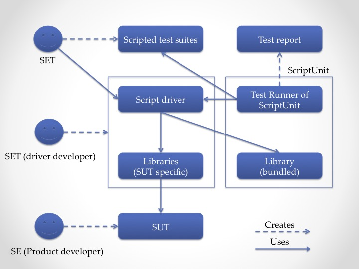

# ScriptUnit

```ScriptUnit``` is a generic framework to build a JSON based DSTL for input-output
systems such as search engines.

# Installation
Include following xml fragment in your ```pom.xml```.

```xml

    <dependency>
      <groupId>com.github.dakusui</groupId>
      <artifactId>actionunit</artifactId>
      <version>{Script Unit Version}</version>
      <scope>test</scope>
    </dependency>
```

For the released versions, you can refer to [this page](https://github.com/dakusui/scriptunit/releases).

# Usage
Following is a diagram that illustrates how engineers and assets are
interacting each other in an ecosystem where ScriptUnit is utilized.




## Scripted test suite example

Full version of this example is found [here](src/test/resources/examples/qapi.json).

```javascript
    {
        "description":"An example test suite to Query-Result model on ScriptUnit",
        "factorSpace": {
            "factors": {
                "terms": [["ヒーター"], ["iPhone"]],
                "sortBy": ["price", "lexical", "relevance"],
                "order" : ["asc", "desc"]
            },
            "constraints": [
                ["if_then", ["equals", ["attr", "sortBy"], "relevance"], ["equals", ["attr", "order"], "desc"]]
            ]
        },
        "testOracles": [
            {
                "description": "Searching 'iPhone' should not return too many accessories",
                "given": ["equals", ["attr", "terms"], ["quote", "iPhone"]],
                "when": ["issue", ["query"] ],
                "then": [">",
                    ["size", ["filter", ["result"], ["containedBy", ["issue", ["with", {"terms":["iPhone&&シルバー"]}, ["query"]]]]]],
                    3
                ]
            },
            {
                "description": "Searching 'ヒーター' should also return items that contain 'ヒータ' or 'ストーブ'",
                "given": ["equals", ["attr", "terms"], ["quote", "ヒーター"]],
                "when": ["issue", ["query"] ],
                "then": ["<",
                  ["-",
                    ["size", ["issue", ["with", { "terms": ["ヒータ", "ストーブ"], "hits":-1 }, ["query"]]] ],
                    ["size", ["result"] ]
                  ],
                  2
                ]
            },
            {
                "description": "Valid queries should result in 200",
                "given": ["always"],
                "when": ["issue", ["query"]],
                "then": ["==", ["value", "statusCode", ["result"]], 200]
            }
        ]
    }
```

## Script driver example
Full version of this example is found [here](src/test/java/com/github/dakusui/scriptunit/drivers/Qapi.java).

```java
    @Load(
        scriptPackagePrefix = "examples", scriptNamePattern = ".*\\.json",
        defaultScriptName = "examples/qapi.json",
        with = JsonBasedTestSuiteLoader.Factory.class)
    @RunWith(ScriptUnit.class)
    public class Qapi {
      ...

      @ReflectivelyReferenced
      @Import
      public Object collections = new Collections();

      @ReflectivelyReferenced
      @Import({
          @Alias(value = "*"),
          @Alias(value = "request", as = "query"),
          @Alias(value = "response", as = "result"),
          @Alias(value = "service", as = "issue")
      })
      public QueryApi<Request, Response, Entry> queryApi = new QueryApi<Request, Response, Entry>() {
        @Override
        protected Request buildRequest(Map<String, Object> fixture) {
          return new Request(fixture);
        }

        @Override
        protected Response service(Request request) {
          List<Entry> matched = new LinkedList<>();
          L:
          for (Entry eachEntry : Entry.values()) {
            for (Request.Term eachTerm : request.getTerms()) {
              if (eachTerm.matches(eachEntry)) {
                matched.add(eachEntry);
                continue L;
              }
            }
          }
          return new Response(matched);
        }

        @Override
        protected Request override(Map<String, Object> values, Request request) {
          Map<String, Object> work = Maps.newTreeMap();
          work.putAll(request.toMap());
          work.putAll(values);
          return buildRequest(work);
        }
      };

      public static class Request {
        public static class Term {
          ...
        }
        ...
      }

      public static class Response extends LinkedList<Entry> implements Iterable<Entry> {
        ...
      }

      @ReflectivelyReferenced
      public enum Entry {
        @ReflectivelyReferenced
        ITEM_01("ヒータ", 15_000),
        @ReflectivelyReferenced
        ITEM_02("ヒーター", 14_800),
        @ReflectivelyReferenced
        ITEM_03("ストーブ", 16_800),
        @ReflectivelyReferenced
        ITEM_03a("ストーブ用ポンプ", 200),
        @ReflectivelyReferenced
        ITEM_03b("ストーブ用替え扉", 480),
        @ReflectivelyReferenced
        ITEM_04("ヒーター", 9_800),
        @ReflectivelyReferenced
        ITEM_05("iPhone 7 ケース", 2_000),
        @ReflectivelyReferenced
        ITEM_06("iPhone 7 シルバー", 48_000),
        @ReflectivelyReferenced
        ITEM_07("iPhone 6 ケース", 1_980),
        @ReflectivelyReferenced
        ITEM_08("iPhone 6Plus シルバー", 68_000),;
        ...
      }
    }
```

# Future works
* Fixture support
* "Regex" factor support
* "Defmacro" and "Defun" supports
* Evaluation inside a JSON object

# References
* [JCUnit](https://github.com/dakusui/jcunit)
* [ActionUnit](https://github.com/dakusui/actionunit)
